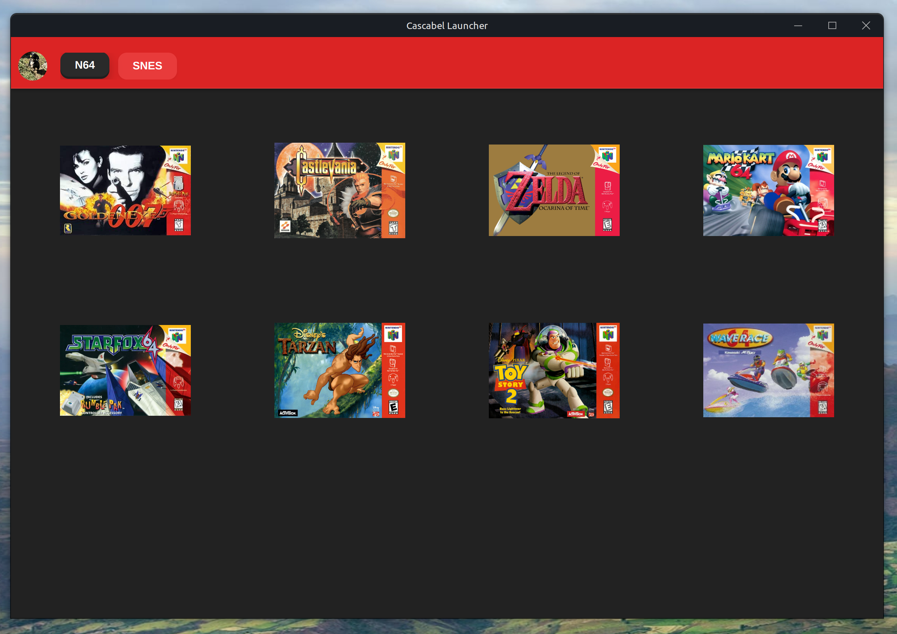

# Cascabel Launcher

Cross-platform game launcher for Windows and Linux.

## Instructions

- Add a console
- Set the name and console type
- Select the executable path
- Select the games folder path
- Select the cover art folder path

**Important**: Game filenames and their cover art filenames must match — each game must have the same name as its corresponding cover image.

## Features

- Multi-emulator management with horizontal tabs
- Configuration of executable, games, and cover art paths
- Customizable themes
- Background music option
- Sort alphabetically or by most played
- Configurable profile picture
- Save configuration for migration

## Installation

Use Cascabel Launcher like any other program by downloading it from the releases section, available for Windows and Linux:

**[Download Cascabel Launcher for my operating system](https://github.com/gessendarien/cascabel-launcher/releases/latest)**

Current version: 1.0.0

## Usage

- Click the settings button (the little dog)
- Add a new tab, executable path, game backups folder, and cover art images folder
- Set up the cover art folder with game covers or artwork
- Save the configuration
- Navigate between tabs to see your different backups grouped by console
- Drag the tabs along their axis to rearrange them
- Right-click on tabs to edit them or sort the content
- If the tab bar is full, you can scroll through all tabs with the mouse wheel

## Disclaimer

**Important**: This program is distributed without any warranty and is non-profit. Any material configured within the program (game backups, console executables, cover art or images, and audio) must be your own creation and you must legally own the rights to use it. This launcher is solely a management and organization tool; it does not distribute, encourage, incite, or provide any material, in whole or in part, protected under copyright law. The user is responsible for complying with all applicable copyright laws in their jurisdiction.

## License

GNU General Public License v3.0

## Thanks

If you like this project and want to support its development, you can make a donation through PayPal:

Any contribution is appreciated and helps keep the project alive! 🐶🧡
