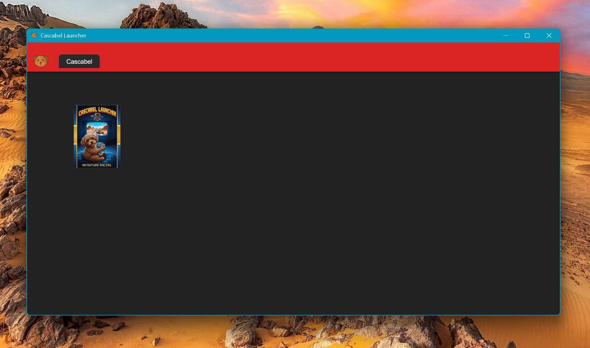

# Cascabel Launcher

Launcher de juegos multiplataforma para Windows y Linux.




## Características

- Gestión de múltiples emuladores con pestañas
- Configuración de rutas ejecutables y carpetas de juegos
- Temas personalizables
- Navegación horizontal por pestañas para cada consola

## Instalación

1. Clona este repositorio
2. Instala las dependencias:
```
npm install
```
3. Inicia la aplicación:
```
npm start
```

## Uso

- Haz clic en el botón de configuración (el perrito)
- Agrega una nueva pestaña, ruta ejecutable, carpeta de los respaldos de tus juegos y la ruta de las imágenes de tus juegos
- Configura la carpeta de carátulas con imágenes de las portadas o arte
- Guarda la configuración
- Navega entre las pestañas para ver tus diferentes respaldos agrupados por consola
- Arrastra las pestañas sobre su eje para organizarlas
- Da click derecho sobre las pestañas para editarlas u ordenar el contenido
- Si llenas la barra, puedes hacer scroll con la rueda del mouse por todas las pestañas

## Personalización

Puedes crear seleccionar el tema de colores que más te guste desde el botón de Configuración > Interfaz

## Disclaimer

**Importante**: Este programa se distribuye sin ninguna garantía de uso y sin fines de lucro. El material que es configurado dentro del programa (backups de juegos, ejecutables de consolas y carátulas) debe ser de tu autoría y debes poseer legalmente los derechos para utilizarlo. Este launcher es únicamente una herramienta de gestión y organización; por lo que no distribuye, alienta, incita ni provee ningún material total o parcial protegido bajo derechos de autor. El usuario es responsable de cumplir con todas las leyes de derechos de autor aplicables en su jurisdicción.

## Licencia

GNU General Public License v3.0


## Descargar

Usa Cascabel Launcher como cualquier programa

**[Releases](https://github.com/gessendarien/cascabel-launcher/releases/latest)**

Disponible para Windows y Linux.

## Gracias

Si te gusta este proyecto y quieres apoyar su desarrollo, puedes hacer una donación a través de PayPal:

[](https://paypal.me/gessendarien)

¡Cualquier contribución es apreciada y ayuda a mantener el proyecto activo! 🐶🧡
